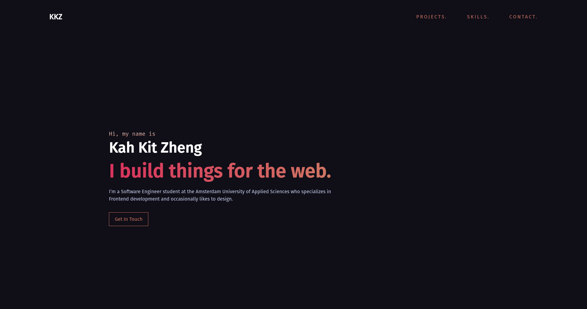
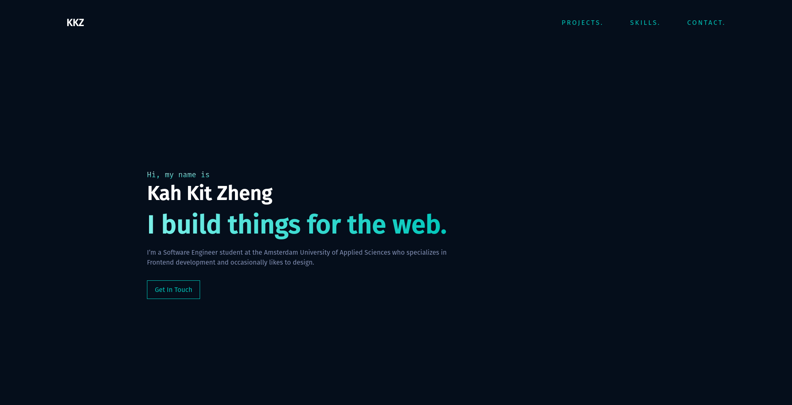
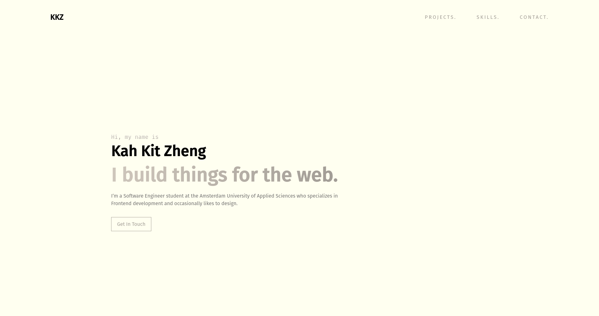

# Portfolio ver. 1.0



The first iteration of my personal portfolio. It showcases my favorite projects, the skills I have developed and ways to contact me. 

You can find the live version at: https://portfolio.kahkitzheng.now.sh/.


## Getting Started

### Installing

1. Clone this repo

```bash
git clone https://github.com/KahKitZheng/portfolio
```

2. Go to the directory

```bash
cd portfolio
```

3. Install the node modules

```bash
npm install
```

### Starting the applicaton
To start the application run the following command:
```bash
npm start
```

The application runs at `localhost:3000`

## Themes
The application is customizable. You can do this by loading your own `_variables.scss` file. By default it shows the **Horizon** theme. Or you can choose other themes that already comes with it.

### Glacier theme
Config can be found
[here](src/themes_example/Glacier/_variables.scss)


### Ivory theme
Config can be found
[here](src/themes_example/Ivory/_variables.scss)


## Built With

* [React](https://reactjs.org/) - A JavaScript library for building user interfaces.
* [Sass](https://sass-lang.com/) - CSS with superpowers.
* [Create React App](https://reacttraining.com/react-router/web/guides/quick-start) - Set up a React app by running one command.
* [Vercel](https://vercel.com/) - Easy deployment process for frontend applications (formerly known as ZEIT).
